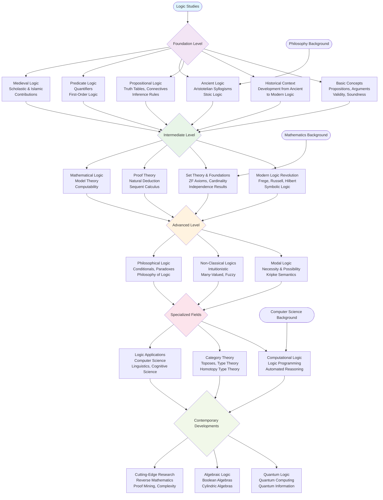

# Logic Roadmap: Foundational Canonical Works

This roadmap presents the essential canonical texts that define the field of logic, tracing its development from ancient origins through contemporary research. These are the "mother books" - the foundational works that any serious student of logic must engage with directly.

The progression follows the historical development of logical thought, but one need not adhere strictly to chronological order. The mature student may begin with medieval logic if approaching from philosophy, or with set theory if coming from mathematics. What matters is understanding that each development builds upon what came before.

## The Roadmap

## Essential Canonical Texts by Level

### Foundation Level
**Aristotle - Organon (Complete Works)**
The foundation of Western logic. The Categories, On Interpretation, Prior Analytics, Posterior Analytics, Topics, and Sophistical Refutations remain essential reading. One cannot understand the development of logical thought without grasping Aristotle's systematic approach.

**Stoic Logic Fragments**
Collected works of Chrysippus and other Stoic logicians. Their propositional logic anticipated many modern developments.

**Medieval Logic Texts**
- **Abelard**: Dialectica
- **Aquinas**: Summa Logicae
- **Ockham**: Summa Logicae
- **Islamic Logic**: Al-Farabi, Avicenna, Averroes

### Intermediate Level
**Gottlob Frege - Begriffsschrift (1879)**
The birth of modern logic. Frege's concept-script revolutionized logical notation and introduced predicate logic as we know it.

**Bertrand Russell & Alfred North Whitehead - Principia Mathematica (1910-1913)**
The monumental attempt to derive mathematics from logic. Essential for understanding the logicist program and the development of type theory.

**David Hilbert - Grundlagen der Geometrie (1899)**
Hilbert's axiomatic method and formalist program. Understanding Hilbert's approach is crucial for modern mathematical logic.

**Ernst Zermelo - Axiomatization of Set Theory (1908)**
The ZF axioms that form the foundation of modern mathematics.

### Advanced Level
**Kurt Gödel - Incompleteness Theorems (1931)**
The papers that shattered Hilbert's program and revealed fundamental limitations of formal systems.

**Gerhard Gentzen - Collected Papers**
Natural deduction and sequent calculus. Gentzen's proof theory remains central to modern logic.

**Saul Kripke - Naming and Necessity (1980)**
Revolutionary work on modal logic and possible worlds semantics.

**L.E.J. Brouwer - Intuitionism**
The challenge to classical logic from the constructivist perspective.

### Specialized Fields
**Alonzo Church - The Calculi of Lambda-Conversion (1936)**
Foundation of computational logic and type theory.

**Saunders Mac Lane - Categories for the Working Mathematician (1971)**
Category theory as a foundation for mathematics.

**Per Martin-Löf - Intuitionistic Type Theory (1984)**
Modern type theory and constructive mathematics.

### Contemporary Developments
**Univalent Foundations Program**
Homotopy type theory and new foundations for mathematics.

**Reverse Mathematics**
Harvey Friedman and Stephen Simpson's program analyzing the logical strength of mathematical theorems.

**Proof Mining**
Ulrich Kohlenbach's program extracting computational content from proofs.

## Approach to Study

The canonical texts demand careful, sustained attention. They are not textbooks written for pedagogical convenience, but original works of discovery. Approach them as you would any serious philosophical or mathematical text - with patience, multiple readings, and willingness to grapple with difficult concepts.

Begin with secondary sources to understand the historical context and main ideas, then engage with the primary texts directly. Many of these works reward years of study and reflection.

The logical tradition represents one of humanity's greatest intellectual achievements. These texts reveal not just technical results, but the evolution of human thought about reasoning itself.

---

**Author**: This work is completely written and created by **Qais Alassa** (Qasawa - qasawa.com - telegram @qalassa)

*True understanding of logic requires engagement with its foundational texts, not merely with modern expositions of their results.* 