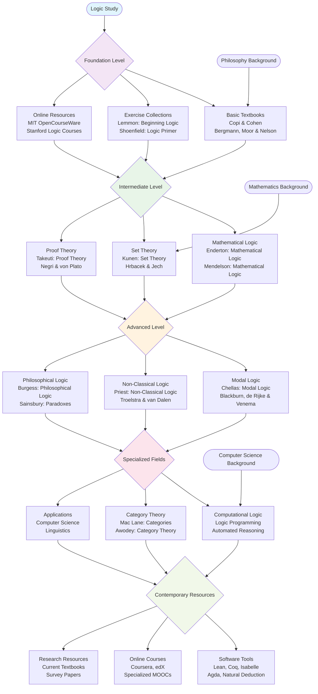

# Logic Study Resources: Practical Learning Materials

While canonical texts provide the foundation, practical study requires comprehensive textbooks, exercises, and tools. This roadmap presents the essential resources for systematic study of logic - materials that students can work through methodically to build competence.

The distinction between canonical texts and study resources is crucial. Canonical texts are works of discovery; study resources are works of exposition and practice. Both are necessary for complete understanding.

## The Roadmap

## Essential Study Resources by Level

### Foundation Level
**Comprehensive Textbooks**
- **Copi & Cohen**: Introduction to Logic - The standard introductory text, comprehensive and clear
- **Bergmann, Moor & Nelson**: The Logic Book - Excellent for learning natural deduction
- **Hurley**: A Concise Introduction to Logic - Accessible introduction with good exercises

**Exercise Collections**
- **Lemmon**: Beginning Logic - Classic workbook for propositional and predicate logic
- **Shoenfield**: Mathematical Logic - Rigorous exercises for the mathematically inclined
- **Goldrei**: Propositional and Predicate Calculus - Clear explanations with worked examples

**Online Resources**
- **MIT OpenCourseWare**: Logic I and Logic II courses with complete materials
- **Stanford Logic**: University-level courses with video lectures
- **Logic Matters**: Peter Smith's comprehensive study guide

### Intermediate Level
**Mathematical Logic**
- **Enderton**: A Mathematical Introduction to Logic - The gold standard for mathematical logic
- **Mendelson**: Introduction to Mathematical Logic - Comprehensive coverage with exercises
- **Bell & Machover**: A Course in Mathematical Logic - Excellent for model theory

**Set Theory**
- **Kunen**: Set Theory: An Introduction to Independence Proofs - Advanced but essential
- **Hrbacek & Jech**: Introduction to Set Theory - More accessible introduction
- **Halmos**: Naive Set Theory - Classic informal introduction

**Proof Theory**
- **Takeuti**: Proof Theory - Comprehensive treatment of structural proof theory
- **Negri & von Plato**: Structural Proof Theory - Modern approach to proof theory
- **Troelstra & Schwichtenberg**: Basic Proof Theory - Systematic development

### Advanced Level
**Modal Logic**
- **Chellas**: Modal Logic: An Introduction - Standard graduate-level text
- **Blackburn, de Rijke & Venema**: Modal Logic - Comprehensive modern treatment
- **Fitting & Mendelsohn**: First-Order Modal Logic - Advanced topics

**Non-Classical Logic**
- **Priest**: An Introduction to Non-Classical Logic - Covers many-valued, relevant, fuzzy logic
- **Troelstra & van Dalen**: Constructivism in Mathematics - Definitive work on intuitionism
- **Rescher**: Many-Valued Logic - Systematic treatment of non-classical systems

**Philosophical Logic**
- **Burgess**: Philosophical Logic - Clear introduction to philosophical applications
- **Sainsbury**: Paradoxes - Excellent treatment of logical paradoxes
- **Haack**: Philosophy of Logics - Philosophical foundations of logic

### Specialized Fields
**Computational Logic**
- **Lloyd**: Foundations of Logic Programming - Definitive treatment
- **Wos et al.**: Automated Reasoning - Comprehensive handbook
- **Clocksin & Mellish**: Programming in Prolog - Practical introduction

**Category Theory**
- **Mac Lane**: Categories for the Working Mathematician - The foundational text
- **Awodey**: Category Theory - Modern pedagogical approach
- **Barr & Wells**: Toposes, Triples and Theories - Advanced topics

**Applications**
- **Huth & Ryan**: Logic in Computer Science - Excellent for CS applications
- **Lappin**: The Handbook of Contemporary Semantic Theory - Linguistic applications
- **Stenning & van Lambalgen**: Human Reasoning and Cognitive Science - Psychological applications

### Contemporary Resources
**Software Tools**
- **Lean Theorem Prover**: Modern proof assistant with excellent documentation
- **Coq**: Mature system with extensive mathematical libraries
- **Isabelle/HOL**: Higher-order logic proof assistant
- **Agda**: Dependently typed functional programming language
- **Natural Deduction Proof Editors**: Various web-based tools for learning

**Online Courses**
- **Coursera**: Logic specializations from top universities
- **edX**: Formal logic courses from MIT and other institutions
- **FutureLearn**: Introduction to logic courses
- **Udacity**: Logic and AI courses

**Research Resources**
- **Handbook of Mathematical Logic**: Comprehensive reference
- **Handbook of Philosophical Logic**: Multi-volume reference work
- **Current survey papers**: Annual reviews and handbook articles

## Software Tools for Logic Study

### Proof Assistants
**Lean**: Modern proof assistant with excellent natural language processing
**Coq**: Mature system with extensive mathematical libraries
**Isabelle/HOL**: Higher-order logic with powerful automation
**Agda**: Dependently typed programming with proof capabilities

### Logic Programming
**SWI-Prolog**: Complete Prolog development environment
**GNU Prolog**: Efficient Prolog compiler
**Logic Programming Systems**: Various implementations

### Educational Tools
**Natural Deduction Proof Editors**: Web-based tools for learning proof construction
**Truth Table Generators**: Automated tools for propositional logic
**Model Checkers**: Tools for verifying logical properties

## Approach to Study

Study resources require systematic engagement. Unlike canonical texts, which reward contemplation, study resources demand active participation. Work through exercises, implement proofs, use software tools.

Begin with comprehensive textbooks that provide both exposition and exercises. Supplement with online resources for different perspectives and additional practice. Use software tools to verify your understanding and explore beyond what hand calculation permits.

The goal is not merely to understand logical concepts, but to develop facility with logical reasoning. This requires practice, repetition, and gradual increase in complexity.

Combine study resources with canonical texts. Use textbooks to understand the techniques, then see how those techniques were discovered by reading the original papers. This dual approach provides both practical competence and historical understanding.

---

**Author**: This work is completely written and created by **Qais Alassa** (Qasawa - qasawa.com - telegram @qalassa)

*Practical competence in logic requires systematic study with appropriate resources, not merely theoretical understanding.*