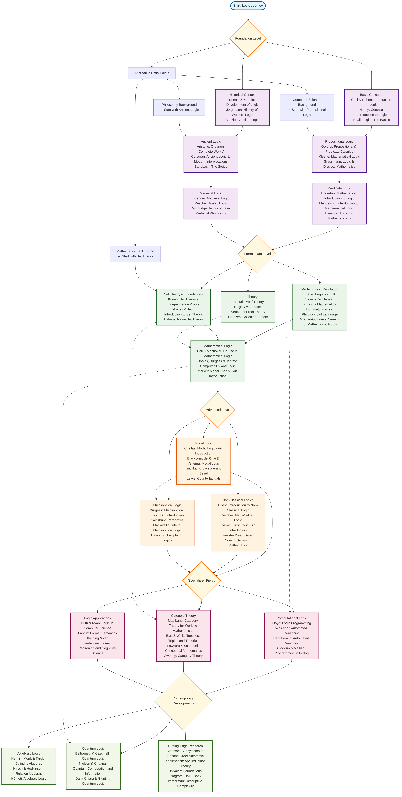
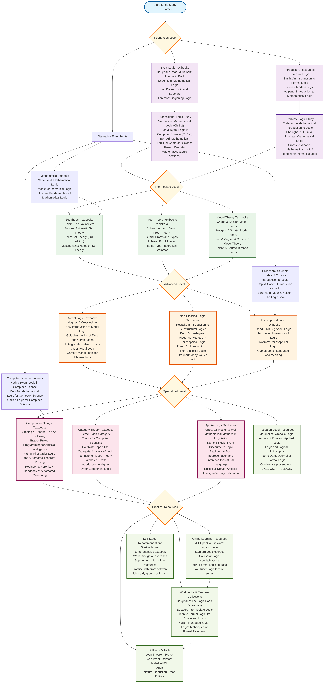
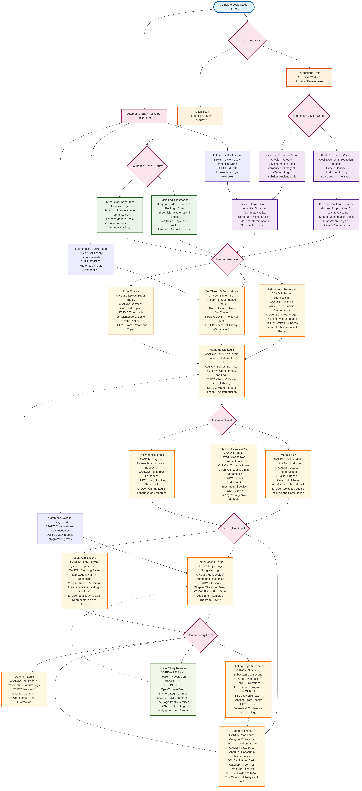

<div align="center">

# Logic Study Roadmaps

### the seed of **Mirqāt · مِرقاة المنطق** — *The Ascent of Logic*

**A cartography of logic — from Aristotle to the contemporary frontier.**
Three roadmaps tracing 2,400 years of reasoning: the canonical *mother books*, the
practical resources to study them, and the lineage that binds it all together.

<br/>

*“Calculemus.” — Leibniz*

</div>

---

## What this is

Logic did not spring forth fully formed. It grew — from Aristotle's syllogistic and the
Stoics' propositional insights, through the medievals, to Frege's revolution, Gödel's
limits, Gentzen's proofs, Kripke's worlds, and the type theories of today.

These roadmaps chart that whole development as a **genealogy**: not a flat reading list,
but a path of ascent through the field, where every idea carries its ancestry and every
subfield opens onto the works that founded it.

There are **three maps**, each in clean Mermaid source (`.mmd`), high-resolution `PNG`,
and scalable vector `SVG`.

---

### Ⅰ · The Foundational Canon — *the mother books*

The essential canonical texts that **define** each field of logic — works of *discovery*,
not exposition. Aristotle's *Organon*, Frege's *Begriffsschrift*, Gödel's incompleteness
papers, Gentzen's collected works, and the line that runs between them.



> Source: [`Logic_Roadmap.mmd`](Logic_Roadmap.mmd) · guide: [`Logic_Roadmap_Visual.md`](Logic_Roadmap_Visual.md) · [vector SVG](Logic_Roadmap_HD.svg)

---

### Ⅱ · Study Resources — *how to actually work through it*

The comprehensive textbooks, exercise collections, software (Lean · Coq · Isabelle · Agda),
and courses a student can move through systematically — the scaffolding beside the canon.



> Source: [`Logic_Study_Resources.mmd`](Logic_Study_Resources.mmd) · guide: [`Logic_Study_Resources.md`](Logic_Study_Resources.md) · [vector SVG](Logic_Study_Resources_HD.svg)

---

### Ⅲ · The Complete Roadmap — *canon and study, unified*

Both views in one — every area tagged **CANON** (works of discovery) or **STUDY**
(works of exposition), with alternative entry points for backgrounds in mathematics,
philosophy, and computer science.



> Source: [`Logic_Complete_Roadmap.mmd`](Logic_Complete_Roadmap.mmd) · [vector SVG](Logic_Complete_Roadmap_HD.svg)

---

## From a map to a platform

This repository is the **origin**. The insight here — *gather the whole of logic and root
it in its sources* — grew into a full bilingual (Arabic / English) study platform:

> ### **Mirqāt · مِرقاة المنطق** — *The Ascent of Logic*
> An interactive *stemma* of the entire field, a navigable canon with the mother books in
> their lineage, a bilingual lexicon of logic's concepts, and a genealogy of the minds who
> built it — every node linked to the next.
>
> *Forthcoming at **almirqat.org**.* These roadmaps are its skeleton.

---

## Coverage

- **Span:** 384 BCE → present — Aristotle to homotopy type theory
- **Tiers:** Foundation → Intermediate → Advanced → Specialized → Contemporary
- **Breadth:** propositional · ancient · medieval · predicate · the modern revolution ·
  set theory · proof theory · mathematical logic · modal · non-classical · philosophical ·
  computational · category theory · quantum · algebraic · the research frontier

## Using the files

The `.mmd` sources render anywhere Mermaid is supported (GitHub, GitLab, the
[Mermaid Live Editor](https://mermaid.live)). To regenerate the high-resolution images:

```bash
mmdc -i Logic_Roadmap.mmd -o Logic_Roadmap_HD.png -w 2400 -H 1800 -s 2 -b transparent
```

---

## Author

Conceived, written, and owned by **Qais Alassa** — *قيس العصا*
[qasawa.com](https://qasawa.com) · Telegram [@qalassa](https://t.me/qalassa)

Suggestions, additional resources, and corrections are welcome via issues or pull requests.

---

<div align="center">

*The study of logic requires patience, a systematic approach, and respect for an
intellectual tradition that spans millennia.*

</div>
